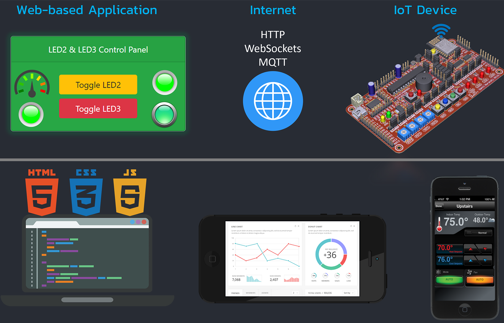

# INC272: Web-Based IoT Applications
> This course focuses on browser-based monitoring and control applications for IoT-oriented workflows. Students build small web applications with HTML, CSS, and JavaScript, use a lightweight Node.js mock hardware simulator, and complete a project-oriented learning path that ends with a group final project.

* * *

[Syllabus](./Syllabus.md) | [Course Outline](./Outline.md) | [Course Orientation](./docs/course-orientation.md) | [Student Quick Start](./docs/student-quick-start.md) | [Setup Guide](./docs/setup.md) | [Troubleshooting](./docs/troubleshooting.md) | [Exam Blueprint](./docs/exam-blueprint.md) | [Exam Sample Questions](./docs/exam-sample-questions.md) | [Week 03 Readiness Checklist](./docs/week03-readiness-checklist.md) | [Project Guide](./docs/project-guide.md) | [Project Examples](./docs/project-examples.md) | [Release Checklist](./docs/release-checklist.md)

* * *

## Course Information

| Item | Information |
|------|-------------|
| Course Code | `INC272` |
| Course Title | Web-Based IoT Applications |
| Academic Year | 2026 |
| Learning Format | Blended learning (`2 online weeks + 4 onsite weeks`) |
| Schedule | Monday, `09:30` |
| Primary Workflow | HTML, CSS, JavaScript, and Node.js mock hardware simulator |
| Default Simulation Path | `Node.js mock hardware server` |
| Assessment | Readiness Task `5%`, Individual Exam `25%`, Group Final Project `70%` |
| Course Language | English |

* * *

## Learning Outcomes

Upon successful completion of this course, students should be able to:

1. Explain the basic structure of a browser-based IoT application.
2. Build simple interfaces with HTML, CSS, and JavaScript.
3. Implement DOM interaction and event-driven UI logic for monitoring and control tasks.
4. Connect browser interfaces to simulated device-like data and interactions.
5. Design and deliver a small group project that demonstrates a complete browser-based monitoring or control workflow.

* * *

## Course Resources

### Course Documents

- [Syllabus](./Syllabus.md) - formal course information, assessment rules, and policies
- [Course Outline](./Outline.md) - 6-week teaching flow and deliverables
- [Course Orientation](./docs/course-orientation.md) - short orientation for the 2026 course model
- [Student Quick Start](./docs/student-quick-start.md) - fastest path to get ready before the first onsite week
- [Setup Guide](./docs/setup.md) - installation and run instructions for Windows and macOS
- [Troubleshooting](./docs/troubleshooting.md) - common setup and runtime problems with fixes
- [Exam Blueprint](./docs/exam-blueprint.md) - topic coverage and question style for the paper-based exam
- [Exam Sample Questions](./docs/exam-sample-questions.md) - sample questions for student exam preparation
- [Week 03 Readiness Checklist](./docs/week03-readiness-checklist.md) - instructor checklist for the first onsite machine check
- [Project Guide](./docs/project-guide.md) - project scope, submission format, and evaluation rubric
- [Project Examples](./docs/project-examples.md) - example project ideas and scope guidance
- [Project README Template](./docs/project-readme-template.md) - Markdown template for the required project documentation
- [Release Checklist](./docs/release-checklist.md) - pre-publish checklist before sharing the repository with students

### Weekly Materials

- [Week 01: Online Foundations](./Week01/README.md) - HTML, CSS, JavaScript basics, and readiness task start
- [Week 02: Online Simulator Familiarization](./Week02/README.md) - mock simulator workflow and starter app testing
- [Week 03: Onsite Readiness Check and Project Briefing](./Week03/README.md) - machine check, workflow verification, and project rubric explanation
- [Week 04: Individual Exam and Project Planning](./Week04/README.md) - paper-based exam and team scope confirmation
- [Week 05: Group Project Implementation](./Week05/README.md) - guided build session and checkpoint feedback
- [Week 06: Final Demo and Presentation](./Week06/README.md) - final project presentation, demo, and repository submission

* * *

## Technologies & Tools

This course uses the following tools and technologies:

- Node.js
- Visual Studio Code
- Chrome 110+, Edge 110+, or another modern browser (Firefox 110+ also supported)
- HTML
- CSS
- JavaScript
- WebSockets through the provided mock simulator

Default workflow notes:

- use the local mock simulator from [simulator/mock-hardware-server](./simulator/mock-hardware-server)
- use the legacy examples in [examples](./examples) as the main practical reference
- do not use `Proteus`, `VSPD`, or Windows-only serial bridge tools in the default path

* * *

## Assessment Breakdown

| Component | Format | Weight |
|-----------|--------|--------|
| Online Readiness Task | Individual | `5%` |
| Individual Exam | Individual, paper-based | `25%` |
| Group Final Project | Group | `70%` |
| Total |  | `100%` |

### Assessment Notes

#### Online Readiness Task

- completed during Weeks 01-02
- checked no later than Week 03
- students must be able to run the required examples and simulator workflow on their own machine
- if the required setup is still not ready by Week 03, the readiness task receives `0`
- the instructor may still help students fix the setup so they can continue into the exam and project phases

#### Individual Exam

- conducted onsite in Week 04
- `paper-based only`
- intended to measure individual understanding without relying on coding tools or AI assistance
- exam scope is limited to the assigned materials and examples in this repository
- strongest emphasis is placed on `HTML`, `CSS`, and `JavaScript` basics
- a small portion may assess understanding of the simulator and browser-to-server interaction flow

#### Group Final Project

- completed in groups
- introduced in Week 03
- refined after the Week 04 exam
- developed during Weeks 05-06
- evaluated as one main category, with internal attention to scope fit, implementation quality, demo quality, and repository quality

* * *

## Policies

### Readiness Task Policy

- readiness evidence must be completed before or during the Week 03 check
- students whose machines are not ready by the Week 03 check receive `0` for the readiness task
- setup support may still be provided after the score decision so students can continue in the course

### Exam Attendance and Make-up Policy

- the exam is conducted onsite in Week 04 according to the scheduled class date and time
- students who miss the exam without a valid reason receive `0`
- students who miss the exam with a valid documented reason may request a make-up exam
- make-up exam scores follow the same strict policy used in the reference course model and are capped at `70%` of the earned score

### Submission Policy

- students are expected to follow the required weekly workflow and submission deadlines
- late readiness submissions are not accepted after the Week 03 readiness check
- late final project submissions may be treated as not submitted unless approval is granted or valid documented evidence is provided

### Academic Expectation

- the readiness task and exam must be completed individually
- the final project must be completed in groups
- students are expected to understand and explain the work they submit

* * *

## Exam Preparation Scope

The paper-based exam is based on the materials explicitly covered in this repository, especially:

- Week 01 HTML examples
- Week 01 CSS examples
- Week 01 JavaScript examples
- Week 02 starter web applications
- browser-side logic taken from the assigned examples
- simple understanding of how the mock simulator supports the web applications

See [Exam Blueprint](./docs/exam-blueprint.md) for the topic distribution and expected question style.

Students should expect questions such as:

- reading and interpreting short HTML, CSS, or JavaScript snippets
- fixing small mistakes in code fragments
- explaining DOM or event behavior
- identifying what a given UI or script should do
- explaining a small piece of simulator-related interaction

* * *

## Course Progression

### Phase 1: Online Preparation

- Week 01: web basics and local readiness
- Week 02: simulator workflow and starter app testing
- outcome: students should arrive onsite already able to run the required examples

### Phase 2: Onsite Launch

- Week 03: readiness verification and project briefing
- Week 04: paper-based exam and project scope confirmation
- outcome: students move into the project stage with a confirmed technical baseline

### Phase 3: Project Implementation and Demo

- Week 05: guided implementation and checkpoint review
- Week 06: final presentation, demo, and repository submission
- outcome: each group delivers a working browser-based monitoring or control application

* * *

## Prerequisites & Requirements

To participate successfully, students should have:

- a laptop computer
- Node.js installed
- Visual Studio Code or a similar editor
- a modern browser
- the ability to run a simple static file server or VS Code Live Server

* * *

## Repository Structure

- [Week01](./Week01/README.md)
- [Week02](./Week02/README.md)
- [Week03](./Week03/README.md)
- [Week04](./Week04/README.md)
- [Week05](./Week05/README.md)
- [Week06](./Week06/README.md)
- [docs](./docs)
- [examples](./examples)
- [simulator/mock-hardware-server](./simulator/mock-hardware-server)
- [tools/example-smoke-test](./tools/example-smoke-test)

* * *

## Status

This repository is the working 2026 teaching base for `INC272: Web-Based IoT Applications`.
